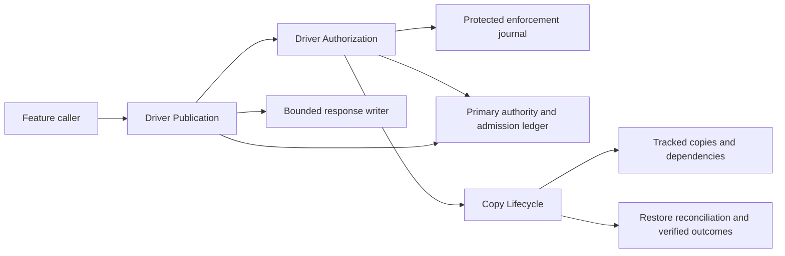

# Driver disclosure and identity persistence ownership

Status: accepted target architecture. The maintainer accepted Q1–Q17 in three live decision rounds
on 2026-10-02; the decision frontier is empty. This document records responsibilities, mechanisms,
and the implementation handoff. It does not describe implemented enforcement, deployed settings,
or provider permission.

Source: [architecture decision #361](https://github.com/jwh3times/apexracers/issues/361), within
[planning map #354](https://github.com/jwh3times/apexracers/issues/354).

## Accepted policy inputs

- [Ownership and consent](https://github.com/jwh3times/apexracers/issues/358#issuecomment-5936739052):
  verified ownership, separate Personal Analytics Consent and Identity Sharing Consent, explicit
  claim-conflict resolution, and fresh proof/consent after identity changes.
- [Anonymous presentation](https://github.com/jwh3times/apexracers/issues/359#issuecomment-5938675485):
  banded hidden rows for signed-in Users, aggregates for visitors, restricted other-Driver detail,
  no other Driver's Customer ID, and current joint-cohort support before pagination.
- [Withdrawal and retention](https://github.com/jwh3times/apexracers/issues/360#issuecomment-5944439567):
  durable cross-instance withdrawal, unsent-response checks, name minimization, purpose-bound
  evidence, copy deadlines, dormant data, derived-record cleanup, browser updates, and restore
  reconciliation. Accepted durations remain policy targets requiring implementation and evidence.

## Accepted foundations: Q1–Q6

### Q1: three deep modules

| Module | Responsibility hidden behind its interface |
| --- | --- |
| Driver Authorization | Ownership proof, claim conflicts, consent scope/version, lifecycle changes, durable current authorization, and authorized Driver names. |
| Driver Publication | Audience selection, currently eligible Driver references, safe projections, hidden-band support and aggregate safeguards, and coordinated final authorization/dispatch. |
| Copy Lifecycle | Earliest applicable cleanup deadlines, physical copy removal, retries, restore reconciliation, and verified completion reporting. |

Feature callers must not reconstruct these protocols. These are responsibility assignments, not
new projects, generic repositories, transport abstractions, or a final method-signature design.
Official Field analysis and owner percentile arithmetic retain their exact internal evidence.

### Q2: PostgreSQL authority and publication coordination

Primary PostgreSQL is the durable authority. Authorization revisions and shared coordination must
cover publication and withdrawal across API instances. A permission check before fetching is
insufficient: final authorization and response dispatch must participate in the same protocol as
withdrawal. Provider fetching stays outside publication coordination. Affected output is withheld
when authority cannot be established.

Q7 selects admission/drain; Q12 and Q15 select independently protected enforcement and recoverable
lifecycle ordering; Q16 selects atomic release accounting. A revision is not by itself permission
to send; SQL transactions do not make network delivery transactional or recall bytes already sent.

### Q3: participating-identity authorization store

Keep verified User/Driver associations, consent, and authorized names in a dedicated authorization
store separate from official racing evidence. Keep private Customer IDs needed for Field
deduplication, analytics, and joins. Remove name snapshots from Race Results and Rival records.
This is not a mirror of the iRacing Driver population and does not prescribe a schema or provider
proof contract. Old-Driver personal evidence remains owned by its original User.

### Q4: separate evidence and authorized personal caches

The shared mapped cache holds name-free internal racing evidence. Apply current authorization and
publication rules whenever producing a response, including warm-cache and historical reads.
Authorized names and private personal payloads have separate purpose/ownership scope and tracked
cleanup. Recheck fetch completion and writes so stale work cannot restore removed personal data or
names. Independence of official evidence retention remains governed by its accepted purpose.

### Q5: recipient- and purpose-scoped references

Eligible other-Driver discovery and detail use opaque references scoped to the recipient and
permitted purpose. Every use rechecks current eligibility. Possession or following supplies no
permission. Hidden-row keys are response-local presentation keys and never address a Driver.
Q13 selects reference lifetime and revision binding. Ineligible, expired, or otherwise invalid
references cannot disclose the Driver's identity or existence.

### Q6: explicit synthetic/live provenance

Carry provenance through requests, stored evidence, cache keys, and publication. Demo data occupies
a separate namespace and cannot establish real ownership or consent. Demo requests remain entirely
synthetic, including cache misses. Numeric IDs and far-future cache expiry are not provenance.

## Accepted mechanisms: Q7–Q13

### Q7: durable admission and drain

Register a bounded response before dispatch. Withdrawal closes new admissions and waits for
previously admitted writers to finish or be verifiably stopped before acknowledging completion.
Unknown writer status keeps acknowledgement pending; neither lease expiry nor a cancellation
request proves terminality. Expensive retrieval/preparation stays outside admission coordination.
Physical-cleanup deadlines start at the original authorization loss, not the end of draining.

This selects the protocol family, not a SQL/network atomicity claim. Admission must cover the actual
response writer; a controller returning a DTO cannot release protection before later serialization.
Buffered output is distinct from already-dispatched bytes. Writer-failure proof and multi-instance
tests remain prerequisites for implementation/rollout evidence under #362.

### Q8: one fixed hierarchy over the whole cohort

Resolve the complete authorized filtered scope before pagination and count distinct hidden Drivers,
excluding the owner and currently disclosed Drivers. Select one level for the entire cohort, using
the finest level where every emitted joint group has at least five such Drivers:

| Level | Lap-time width | Absolute iRating width |
| --- | --- | --- |
| Base | 0.5 seconds | 250 points from 1000 inclusive to 2500 exclusive; 500 points outside |
| 1 | 1 second | 1000 points |
| 2 | 2 seconds | 2000 points |
| 3 | 4 seconds | 4000 points |
| 4 | 8 seconds | 8000 points |

Use fixed zero origins and lower-inclusive/upper-exclusive intervals; the partitions are nested.
Use exact boundary arithmetic. Unsupported measurements are omitted before constructing the release
vector; any visible missingness is another supported grouping dimension, not a small leftover row.
No absolute-rating validity rules are inferred from unverified source sentinels, and rating deltas
do not inherit absolute-rating bands. Every retained field/context requires publication assessment.

If no level qualifies, try only an approved aggregate representation; unsafe output is suppressed.
The hierarchy does not authorize unreviewed exact positions, deltas, incidents, race references,
or custom filters. Internal Field membership and owner percentile arithmetic remain exact.

### Q9: group summaries and composition review

Emit one summary per approved band group, without exact counts or Driver-addressing keys. This
explicitly refines #359's prototype one-row-per-hidden-Driver presentation, which discloses exact
group cardinality. A response-local group key can describe a displayed band tuple, never identify
its contributing Drivers. The existence/number of groups still conveys information; no claim of
zero count information or proven anonymity is made.

Driver Publication owns a reviewed query catalog and evaluates overlapping views, prior releases,
totals, owner variants and external racing context together. Aggregate fallback uses the same gate.
Unresolved contexts remain unavailable. Q14 selects the initial aggregate contract and Q16 selects
atomic accounting for concurrent/pending releases; a five-Driver floor is not an anonymity proof.

### Q10: durable cleanup and source dependencies

Record cleanup work with the triggering transition. Track the earliest applicable deadline,
idempotent retries, stale-write protection, applicable copy inventory, and verification outcomes.
Personal records carry their owning User/Driver association and source dependencies so deletion
invalidates dependent summaries or rebuilds them only from independently authorized retained
evidence. Historically unverifiable provenance stays unavailable until reconciled.

Keep the original loss/request time through retries and recovery. Report durable withdrawal,
verified live erasure, backup expiry, and overdue work separately. A job running or a logical denial
does not establish physical removal. Q17 ends dormant reactivation eligibility at day 90; physical
removal is required by day 97.

### Q11: browser validity and polling

Clear affected state immediately on owner withdrawal. While connected, poll authority at least
every 15 seconds and cap display validity at 30 seconds from the last check's start. Denial,
uncertainty, or expiry clears affected state. Revalidate on navigation, focus, and reconnect; reject
responses from obsolete authorization generations and apply `no-store` to sensitive responses.
Push notifications can accelerate updates. A delayed check cannot restart validity from receipt.
Suspended/offline sessions revalidate before displaying again; exported/already-delivered material
remains outside recall guarantees.

### Q12: independently protected enforcement journal

Protect minimal enforcement history independently from ordinary application-data restoration.
Required withdrawal/deletion entries must be durable before acknowledgement. Restoration remains
closed until current enforcement is reconciled and overdue cleanup verified; unavailable or
uncertain authority keeps affected data unavailable. A restored revision number alone establishes
neither permission nor absence of later revocations.

Exact resources, durability settings, backup topology and deployed verification remain operator
work. Q15 selects journal-first intent and idempotent recovery after partial failures; no cross-store
atomic transaction is assumed.

### Q13: short-lived references, durable private follows

Issue unpredictable recipient/purpose-scoped Driver References valid for 15 minutes and bound to
the relevant authorization revision. Recheck every use. Reference expiry does not expire consent.
Saved follows keep only their private internal association and receive fresh references in eligible
views. Withdrawal hides/deactivates follows immediately; valid sharing can reactivate during the
accepted 90-day inactive window, with physical removal by day 97 otherwise.

An expired reference is not a hidden Driver handle and supplies no reason to expose raw Customer
IDs as an alternative. Reassignment/relinking cannot revive a prior authorization generation.

## Code-backed starting point

These observations concern the repository, not any deployed dataset:

- [Claim updates](../../src/ApexRacers.Api/Services/AuthService.cs) verify the local password;
  the provider callback is unimplemented. No consent authority or publication coordination exists.
- [Subject Driver resolution](../../src/ApexRacers.Api/Services/SubjectDriverContext.cs) chooses
  Demo Driver or a stored claim. Designation is not permission.
- [Race detail](../../src/ApexRacers.Api/Services/SubsessionDetailService.cs),
  [standings](../../src/ApexRacers.Api/Services/StandingsService.cs), and
  [Rival operations](../../src/ApexRacers.Api/Services/RivalService.cs) publish names/Customer IDs
  through distributed projections; some routes are anonymous.
- [Mapped cache](../../src/ApexRacers.Api/Services/CachedIRacingClient.cs) returns fresh mapped
  payloads and writes fetched payloads without authorization-generation checks.
- [Cache cleanup](../../src/ApexRacers.Api/Services/ExternalDataCacheCleanupService.cs) uses a
  six-hour loop and two-day expiry grace, without durable deadline/completion tracking.
- [Telemetry upload](../../src/ApexRacers.Api/Services/TelemetryUploadService.cs) relies on claims
  and permits uploads without a claim; verified attribution and non-identifying previews are later
  implementation changes.
- [Browser request lifecycle](../../web/src/hooks/resourceRequest.ts) already suppresses replaced
  requests, but has no authorization revision or connected withdrawal revalidation.

## Accepted final clarifications: Q14–Q17

### Q14: one initial aggregate release artifact

Visitors and aggregate fallback initially receive only approved band-group ranges derived from the
same reviewed publication artifact. Do not add an independent family of exact counts, extrema,
medians, positions, or custom predicates. Visitors receive no opted-in names or Driver References.
This is an aggregate group representation, not one row per hidden Driver. Its occupied groups/range
boundaries still convey information and remain subject to the combined-release gate.

Include owner-visible metrics in composition review while preserving the accepted exact owner
Percentile Rank arithmetic. Existing Field Size, Field Position, histograms and extrema are additional
releases, not implicitly approved because they share that response. Withhold unsafe supplementary
output; do not silently change the owner's formula to make an additional publication pass.
An approved representation is not approval of every context: unreviewed or unsafe catalog scopes
remain unavailable, including contexts with reconstructible external race classification.
If no supported artifact can be admitted, this initial range-only fallback produces no hidden
output; it cannot rescue a failed support/composition check by independently exposing a sparse
statistic. Audience/owner variants require their own coherent cohort and combined assessment;
approval cannot be copied between recipients without that check.

### Q15: journal-first lifecycle intent and recovery

Driver Authorization owns one idempotent lifecycle operation:

1. Validate the authenticated actor and permitted transition using the existing accepted
   proof/conflict/consent rules. Assign a stable operation identity and original action/loss times.
2. Durably record the minimal enforcement intent in the independently protected journal first.
   Pending intent vetoes affected acquisition/publication until reconciled. It cannot grant consent.
3. In primary PostgreSQL, apply authorization closure/revisions and transition-triggered cleanup
   work together. Affect every relevant association, follower and cohort dependency; deadlines
   retain the original times and earliest applicable policy.
4. Prevent new admissions and invalidate unsent work; drain previously started writers until
   completion or verified inability to continue. Unknown writer status remains pending.
5. Record the reconciled completion checkpoints and acknowledge only when required journal entries,
   primary enforcement, and writer terminality are established. Physical erasure and backup expiry
   are later, separately verified outcomes.

Journal success followed by primary failure, primary commit uncertainty, and repeated delivery resume
the same operation from checkpoints. A partial/uncertain result cannot reopen affected access or
claim completed withdrawal. Unfinished intents remain effective after restore and must be replayed.
Publication cannot rely on primary state known to lag required journal enforcement; unavailable
or unestablished current enforcement keeps affected output closed. Primary PostgreSQL remains the
grant authority; journal enforcement only vetoes/reconciles and never revives grants.

The primary transition atomically records cleanup intent, not physical deletion across every store.
No distributed atomic transaction between PostgreSQL, the independent journal, HTTP, or backups is
assumed. Exact resources and transaction primitives must satisfy this ordering through later
implementation and fault evidence.

### Q16: atomic admission and combined-release accounting

Driver Publication prepares outside admission, then reviews and reserves the proposed representation
atomically with its durable publication admission in primary PostgreSQL. Bind current authorization,
full-cohort membership/evidence, provenance, recipient/purpose, catalog revision, and reconciled
enforcement state. A catalog is immutable/versioned once reviewed; changing fields or scope requires
new assessment, not a caller-supplied parameter.

Review completed, pending, and possibly dispatched releases together across overlapping scopes,
recipients and owner variants. Two concurrent publishers cannot both pass against a history that
omits the other's reserved output. Unknown dispatch remains a possible disclosure in the internal
release ledger; lease expiry never deletes its contribution to composition review.

The same coordination covers hidden contributors: a sharing grant can remove a Driver from a
five-Driver hidden group, while withdrawal, late ingestion or corrections can change the complete
projection. Shared Core/Data writers advance the relevant evidence/cohort revisions. Changed
dependencies before dispatch invalidate/rebuild the whole representation or deny it; hiding a name
alone does not repair stale support. Once dispatch starts, the accepted drain interval applies.

Protected release manifests/ledger data are internal enforcement records, not public stable Driver
keys or a second profile archive. Retain only what the continuing enforcement purpose requires,
with scope/release dependencies and assessed earlier outputs; do not log Driver identities or
telemetry. Unresolved composition or authority blocks publication, not the independent internal
Field calculation. Risk testing/admission evidence must precede a catalog becoming usable.

### Q17: restoration eligibility ends at day 90

Dormant personal data can be restored for the same original User/Driver only with fresh valid proof
and Personal Analytics Consent before day 90. At day 90 it is deletion-due and no longer eligible
for restoration; days 90–97 are the physical-removal window, not additional restoration time.
Explicit deletion remains irreversible. New proof, consent or a new Driver association cannot
resurrect deletion-due/deleted copies or transfer them to another User.

This clarifies #360's previously ambiguous "before deletion" wording; it does not extend the
accepted day-97 deadline. The inactive-follow policy already ended reactivation at day 90. Valid
new authorized collection remains a separate operation with new provenance, never a reset of a
stale cleanup clock. No historical loss time or identity attribution may be guessed during migration.

## Module interfaces and placement

These semantic entry points are a review sketch, not selected wire types, schema, or new endpoints.
They show where callers stop knowing the accepted protocol. Concrete method/type spelling and
physical files are implementation choices; the responsibilities and invariants here are the
reviewable interface contract.

| Module | Semantic entry points | Hidden implementation responsibilities |
| --- | --- | --- |
| Driver Authorization | Resolve authorized acquisition; apply an ownership/consent lifecycle transition | Provider-proof adapter, scope/version checks, association conflicts, current revisions, names, reference eligibility, journal/primary-store recovery, and transition-triggered work. |
| Driver Publication | Read/publish a reviewed view request for its recipient | Subject/reference resolution, current audience/provenance, source loading, whole-cohort preparation, catalog/composition review, admission, bounded serialization/dispatch, and release accounting. |
| Copy Lifecycle | Commit an authorized tracked copy; execute due cleanup/recovery; report completion | Copy/dependency inventory, generation checks, earliest deadlines, stale-write fences, retries, verification, dormant ownership, backup exceptions and restore reconciliation. |

The ordinary HTTP caller binds input and returns a module-owned protected result. The HTTP adapter
executes admission and dispatch inside that result; no feature caller receives a publishable DTO
and separately starts/stops an admission. The mechanism is deliberately tier-spanning: controllers
do not acquire locks, interpret generations, or coordinate drain/cleanup/journal writes.

An illustrative call is `return await publication.ReadAsync(viewRequest, recipient, cancellation)`.
Its result owns later serialization/write execution; the example does not choose ASP.NET types for
Core or prescribe method spelling. Feature-specific requests stay explicit rather than exposing
arbitrary SQL predicates, output fields, safety thresholds, or a generic command/query framework.

Place pure transition/projection rules in Core; shared EF persistence/enforcement in Data; request
orchestration and the actual HTTP adapter in Api. Ingestion and Seeder use shared Core/Data write
enforcement, preserving the prohibition on Api–Ingestion references. No new project, generic
repository, cloud service or container topology is selected here.

Real seams include provider acquisition versus controlled synthetic responses, primary PostgreSQL
versus real local PostgreSQL test fixtures, independently protected journal versus fault-controlled
test storage, and ASP.NET writing versus controlled delayed/failing writers. In-memory storage
alone cannot validate database concurrency/atomicity. Time is explicit in policy/cleanup tests.
Registered-client proof contracts and deployed storage settings remain separate verification gates.

## Surface and copy coverage

| Existing surface/source | Target owner and outcome |
| --- | --- |
| Profile, progression, achievements, recent races, My Laps, private analytics, own percentile/recommendations | Authorization derives the verified, personally consenting Subject Driver; Publication controls private response dispatch and assesses supplementary Field-derived releases without changing exact owner percentile arithmetic. |
| Anonymous Race detail and championship/Time Trial/qualifying standings; signed-in leaderboard | Publication projects eligible names only to the permitted signed-in audience, and only admitted hidden groups/visitor aggregates. Source positions, individual keys and exact race context cannot leak through hidden representations. |
| Rival list/search/suggestions/follow/comparison and official other-Driver lap traces | Publication resolves current recipient/purpose Driver References, never arbitrary raw Customer ID permission. Private follows do not grant access; ineligible targets have generic unavailability. Shared evidence excludes uploads/private history. |
| Week/car distribution and other count/time summaries, world-record overlays | No identity fields does not automatically establish safe aggregate publication. Catalog/composition assessment covers counts, extrema, histograms and joins/context; unreviewed additions are withheld. |
| Telemetry parsing, receipt, attribution, temporary files and Uploaded Laps | Authorization requires matching verified personal ownership before attributed persistence/use. Other previews are transient and non-identifying; mismatches disclose neither identity. Copy Lifecycle removes temporary/orphan material and tracks source-dependent personal records. |
| Ingestion/backfill and mapped caches | Shared write enforcement strips unauthorized names before durable persistence, checks provenance/current purpose and generations, advances evidence/cohort revisions, and prevents stale writers from recreating prohibited copies. |
| Every follower, dormant old-Driver uploads/history, dependent personal snapshots/summaries | Authorization applies current eligibility/dormancy; Copy Lifecycle preserves original ownership and clocks, deactivates references, and verifies cleanup/rebuild instead of copying deleted evidence into derivatives. |
| Live databases/replicas, app-managed caches/temp storage, enforcement/audit records, logs and backups | Copy Lifecycle covers the applicable inventory and separate maximums, exceptions, retries and verified outcomes; operator evidence establishes actual deployed coverage/settings. Logs exclude identities/telemetry and redact identifier/reference-bearing paths. |

Independent official evidence remains under its accepted continuing purpose, even for non-Users
or after a User's personal withdrawal/deletion. Sharing authorization is not a Field-membership
condition. Collection stays limited to active Seasons and authorized historical feature requests;
purpose review can make independent evidence deletion-due without granting named publication.
Required private IDs and minimal evidence remain separate from personal-owned uploads/derivatives.

## Technical evidence and implementation handoff

- [Publication/withdrawal coordination](../research/driver-publication-coordination-2026-10-02.md)
  distinguishes database authority, application dispatch, and already-sent bytes; documents locking
  and admission/drain candidates and their failure proof obligations.
- [Publication safety](../research/driver-publication-safety-2026-10-02.md) examines joint support,
  external linkage, exact counts, coarsening, and repeated-release composition. Candidate algorithms
  are proposals, not accepted policy or anonymity proofs.

The architecture decision tree is settled. Implementation proof obligations are distinct from open
product choices. #362 selects the scenario matrix, acceptance evidence, migration order, and live
rollout gates. Carry these obligations forward:

| Owner | Required evidence/handoff |
| --- | --- |
| Driver Authorization | Verified versus asserted identity, two scopes/versioned opt-in, explicit conflict/reassignment, routine expiry versus detected revocation, journal-first partial failures and original-clock preservation. |
| Driver Publication | Two-instance admission/withdrawal races through actual writers; current hidden-cohort support; immutable catalog and atomic pending/prior-release accounting; combined owner/visitor views and linkage tests; unavailable authority; no Driver IDs/names in disallowed JSON, URLs, keys or errors. |
| Copy Lifecycle | Names/replicas/mapped caches/temp uploads/followers/dormant old-Driver data/derived records; stale writes and overdue retries; physical verification and separate reporting; day-90 reactivation boundary; journal reconciliation before restored data serves. |
| Browser | Immediate owner clear, 15-second polling and 30-second validity measured from check start, obsolete results and delayed checks, navigation/focus/reconnect and suspended sessions, sensitive no-store. |
| Shared writers/migration | Explicit provenance and revision advancement, authorized copy creation, existing names removed, unverifiable historical attribution unavailable, independent official evidence preserved under continuing purpose. |

Do not assume a SQL lock, expired permit, callback, or process-liveness claim proves that an HTTP
writer cannot continue. Partition/session-loss/late-dispatch feasibility must be demonstrated with
controlled adapters; inability to establish terminality keeps completion pending and gates rollout.
Catalog review must include occupied-group changes, prior output, exact owner metrics and external
knowledge. Neither the five-Driver floor nor the fixed query catalog proves anonymity.

Provider proof/revocation contracts require obtainable SDK/captured/client evidence before their
implementation. Actual journal/storage/backup/log settings and restore coverage remain unverified.
Conditional operator verification remains tracked through the
[human-follow-up procedure](../agents/human-actions.md), with operational instructions kept in
private destinations. It becomes applicable only after #362, implementation, synthetic rehearsal,
and proposed rollout/publication. Processing-permission review and OAuth/operator prerequisites remain
separate; these decisions do not grant processing permission or enable live flags.

[ADR 0005](../adr/0005-driver-authorization-and-identity-persistence.md) replaces ADR 0001's target
identity-persistence consequences while preserving private identifiers and rejecting a Driver
population mirror. [ADR 0006](../adr/0006-driver-publication-requires-current-authorization.md)
replaces ADR 0004's unrestricted lookup target. Both distinguish accepted target from current code.
This discussion does not change endpoint access or authorize migrations, live activation, production
inspection, or provider contact. Acceptance evidence and rollout gates belong to #362.
